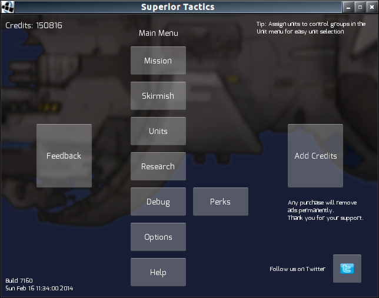
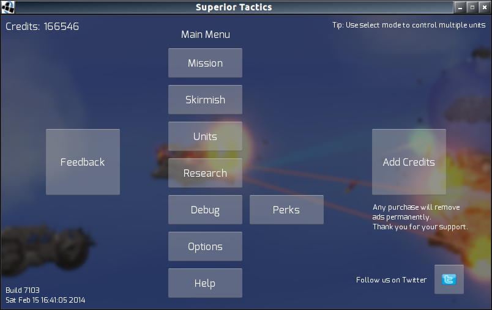
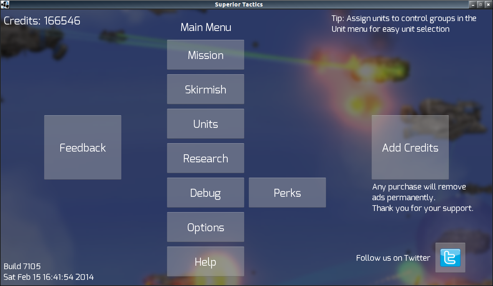

gdx-smart-font
==============

LibGDX - Generate bitmap fonts in proportion to screen size and cache them to file.

SmartFontGenerator is a class you can copy/paste into your libgdx project to smartly generate bitmap fonts.

It makes use of gdx-extension FreeTypeFontGenerator.  If you are unfamiliar with this extension, please read up on it
[here](https://github.com/libgdx/libgdx/wiki/Gdx-freetype)

####Used In (edit this README to add your app)
* [Superior Tactics](https://play.google.com/store/apps/details?id=org.jrenner.superior)

#Purpose

This class provides several benefits:

* Creating fonts for different screen sizes using Hiero or BMFont can be troublesome, if you have 4 fonts of different sizes
and are targeting 5-6 different screen sizes, you then must generate 20-24 bitmap font pngs.  By using generated fonts they can be dynamically scaled at the time of creation based on screen size.

* Generating fonts cuts down on app download size, no need to include pngs.

* Generating fonts can add significant time to app startup time.  Caching the generated fonts to file, and only regenerating when needed allows for fast app startup most of the time.

#Drawbacks

There are some drawbacks:

* The generated fonts sometimes do not look as good as those generated by Hiero/BMFont.  This can be worked around somewhat by playing with size values or choosing a different font.
 
* (TODO) The current version does not automatically find the best png page size for writing the fonts to file.  It defaults to 512, but you may adjust it manually if that is too large or too small.

* (TODO) The generated fonts are not packed into your UI skin, so drawing the font will force a separate texture bind.

#How To Use

1. Make sure your project/workspace has the libgdx freetype extension

2. Copy the SmartFontGenerator class somewhere into your project/workspace

3. See the [ExampleMain class](/src/org/jrenner/smartfont/example/ExampleMain.java)
for how SmartFontGenerator should be used inside your app.

#Example Screenshots

